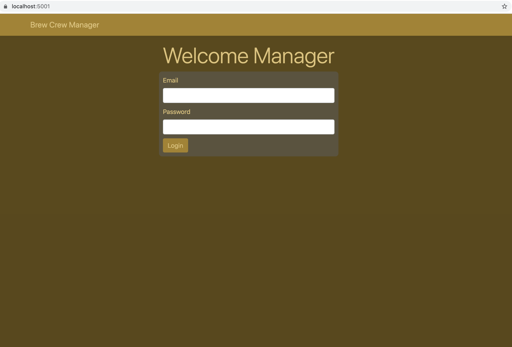
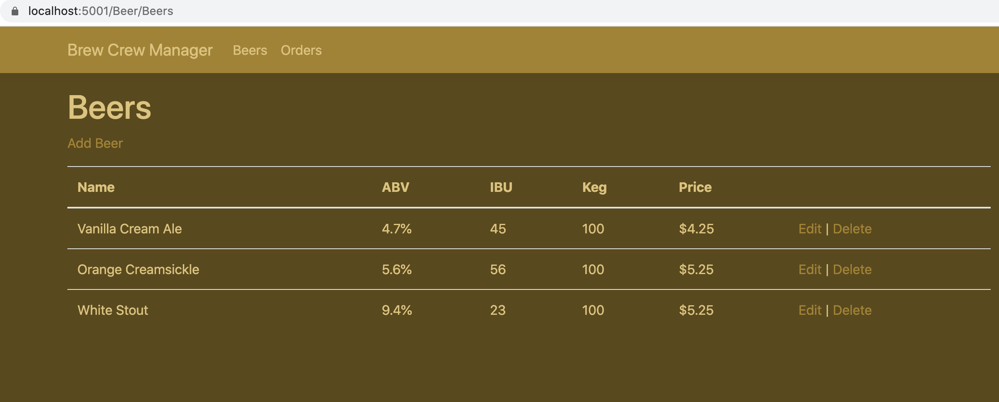
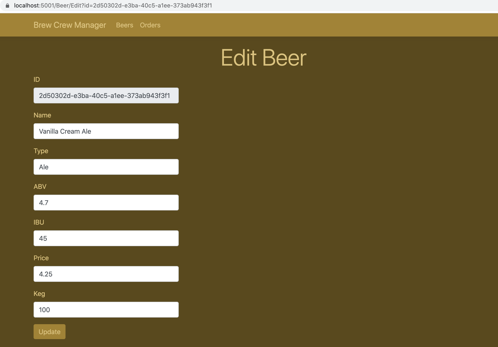
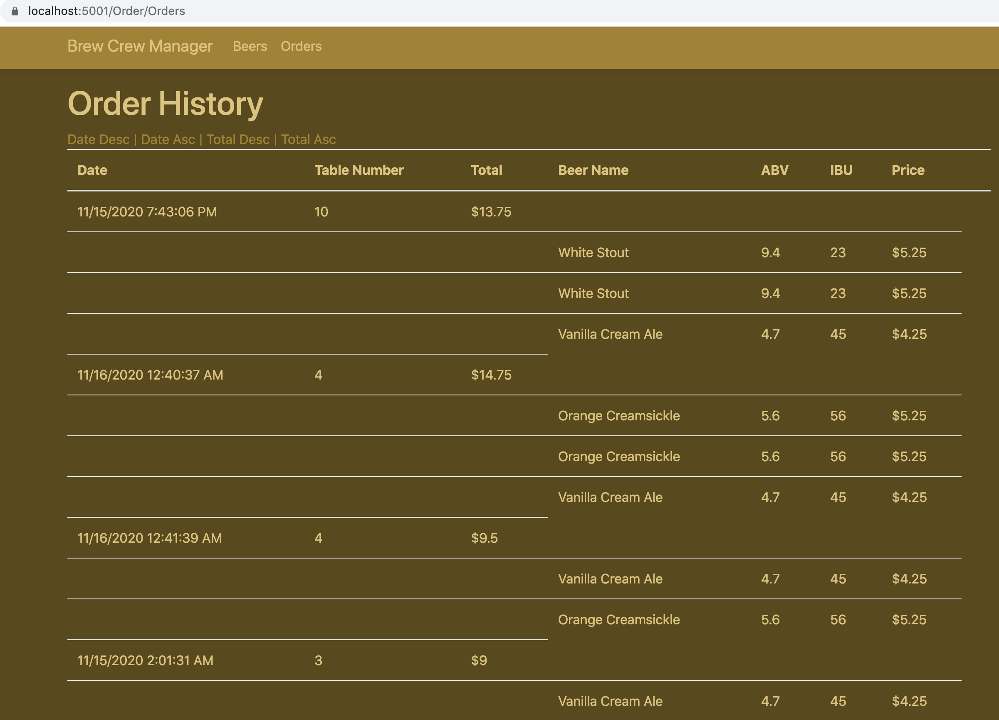
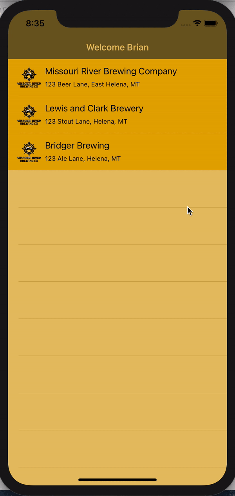
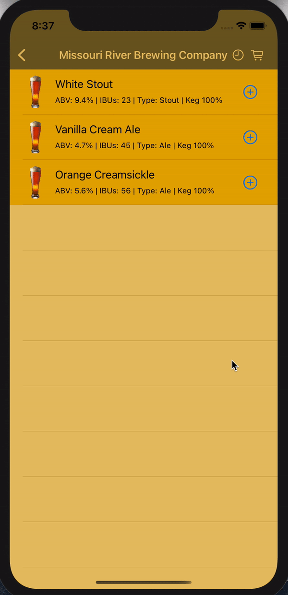

# Brew Crew

## Project Description
Brew Crew is a beer management system for brewery owners. It enables brewery managers to add, edit, and delete beers specific to their brewery. Additionally, customers can access an IOS app and view beers at a specified location, place orders, create an account, and view order history.

## Technlologies Used

* ASP.net
* Entity Framework Core
* PostgreSQL
* xUnit Testing
* C#
* Swift 5.2
* HTML
* CSS

## Features
* Add, edit, delete beers
* View brewery order history
* View customer order history
* Order single or multiple beers
* Create user account
### Feature Roll-Out:
* Beer sensor client that obtains the amount of beer left in a keg. This will communicate with the postgreSQL DB through the API
* In-depth data analysis for brewery managers. This will give the managers the option to generate charts and other visual tools to be able to view beer sells by type, data(season), alcohol content, bitterness, and name
* Beer archive. Once an order has been placed by a customer for a particular beer, the beer cannot be deleted. I will add archive functionality to make it so managers can add/remove beers from menu. This is great for seasonal beers

## Getting Started
Note: to run the IOS application, you must have macOS 10.14 or later and xcode 11 installed. Most of the code is not swift 5.2 specific so if you decide to use an earlier version of swift only minor changes, if any at all, would need to be changed. Therefore, it is possible to run on earlier versions of macOS.

Run the API. In a terminal window:
1. clone the directory:
`git clone https://github.com/201019-UiPath/FoleyBrian-Project1.git`
2. navigate to the API Folder
`cd FoleyBrian-Project1/API`
3. run the following dotnet command. This will run the api on your local server port 47720
`dotnet run --project BrewCrewAPI`
4. minimize the terminal window

Run the API. In a new terminal window:
1. navigate to the ManagerUI Folder
`cd FoleyBrian-Project1/UI/ManagerUI`
3. run the following dotnet command. This will run the web app on your local server port 5001
`dotnet run --project ManagerUI`
4. minimize the terminal window

Open a browser window and input the url
`localhost:5001`

Open xcode and run the application on an iphone simulator of your choice

## Usage
### Manager Web App

Manager login screen 
 
Manager beer list screen 
 
Manager update beer screen 
 
Manager order history screen 
 

### IOS Application

Customer navigating breweries 
 
Customer placing an order 
 
Customer viewing order history 
 

## Contributors
Special thanks to <a href='https://github.com/jjennings510'>Jacob Jennings</a> for helping out with routing, json serialization, and http requests
## License
